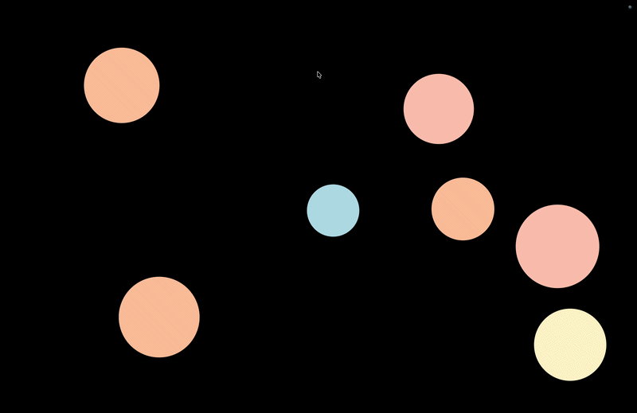

# Avoid The Balls

This is my first game ever I actually put quite some effort in. The idea is simple, try to avoid the balls from hitting your cursor!

## Technical Overview
* Coded the game in Java using the JavaFX framework. No game engine is used whatsoever.
* Applied Entity Component System (ECS) architecture to keep good structure in the code.
* Collision detection is performed in two stages. First, a sweep-and-prune (SAP) algorithm is used to quickly eliminate clearly non-overlapping objects. Then, a more computationally intensive algorithm is applied to the remaining candidates.
